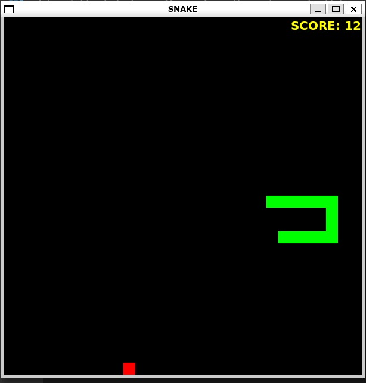
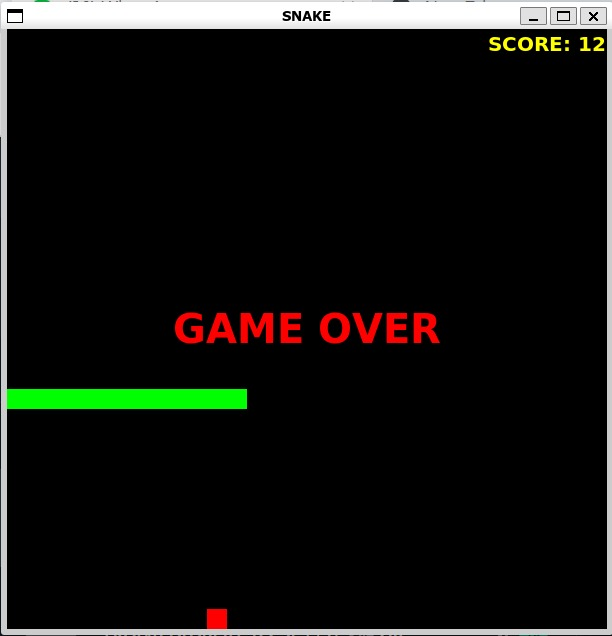

# Snake: The Game

This game was made by me as a part of my CS 154 course.
A game of Snake was made using C++ and the graphics library FLTK.

## The following are the rules of the game:

1. There is a snake (in green) which can be moved using the WASD keys or the arrow keys
2. As the snake moves it leaves a trail behind
3. The Game is over if the snake hits itself or if it hits the boundaries of the screen
4. Food for the snake is located at random positions on the screen
5. The snake starts with length 1
6. As the snake eats the food, its length increases, thus increasing the difficulty of the game
7. When food is eaten more food appears at a different location
8. The score is equal to the amount of food eaten (which is equal to it's length - 1)
9. The aim of the game is to maximize the score

## Usage Instructions
1. [Install FLTK](https://www.fltk.org/doc-1.3/intro.html)
2. Run ```fltk-config --compile snake.cpp && ./snake```

## Some Images from the Game

